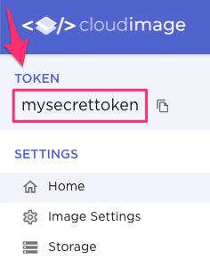

# cloudimage


`cloudimage` is the official Ruby API wrapper for
[Cloudimage's API](https://docs.cloudimage.io/go/cloudimage-documentation-v7/en/introduction).

Supports Ruby `2.4` and above, `JRuby`, and `TruffleRuby`.

- [cloudimage](#cloudimage)
  - [Installation](#installation)
  - [Usage](#usage)
    - [Hash of params](#hash-of-params)
    - [Chainable helpers](#chainable-helpers)
    - [Aliases](#aliases)
    - [Custom helpers](#custom-helpers)
    - [Security](#security)
      - [URL signature](#url-signature)
      - [URL sealing](#url-sealing)
  - [Development](#development)
  - [Contributing](#contributing)
  - [License](#license)
  - [Code of Conduct](#code-of-conduct)
  - [Showcase](#showcase)

## Installation

Add this line to your application's Gemfile:

```ruby
gem 'cloudimage'
```

And then execute:

    $ bundle install

Or install it yourself as:

    $ gem install cloudimage

## Usage

The only requirement to get started is your customer token. You can
find it within your Admin interface:



In order to interact with Cloudimage, we'll first initialize a client service
object:

```ruby
client = Cloudimage::Client.new(token: 'mysecrettoken')
```

Cloudimage client accepts the following options:

| Option             | Required? | Additional info                                     |
| ------------------ | --------- | --------------------------------------------------- |
| `token`            | Yes       |                                                     |
| `salt`             | No        | See [Security](#security).                          |
| `signature_length` | No        | Integer value in the range `6..40`. Defaults to 18. |
| `api_version`      | No        | Defaults to the current stable version.             |
| `sign_urls`        | No        | Defaults to `true`. See [Security](#security).      |

Calling `path` on the client object returns an instance of `Cloudimage::URI`.
It accepts path to the image as a string and we we will use it to build
Cloudimage URLs.

```ruby
uri = client.path('/assets/image.png')
```

Here are some common approaches for constructing Cloudimage URLs using this gem:

### Hash of params

Pass a hash to `to_url`. Every key becomes a param in the final Cloudimage
URL so this gives you the freedom to pass arbitrary params if need be.

```ruby
uri.to_url(w: 200, h: 400, sharp: 1, gravity: 'west', ci_info: 1)
# => "https://mysecrettoken.cloudimg.io/v7/assets/image.png?ci_info=1&gravity=west&h=400&sharp=1&w=200"
```

### Chainable helpers

Every param supported by Cloudimage can be used as a helper method.

```ruby
uri.w(200).h(400).gravity('west').to_url
# => "https://mysecrettoken.cloudimg.io/v7/assets/image.png?gravity=west&h=400&w=200"
```

While every key passed into `to_url` method gets appended to the URL,
chainable helper methods will throw a `NoMethodError` when using an
unsupported method.

```ruby
uri.heigth(200).to_url
# NoMethodError (undefined method `heigth' for #<Cloudimage::URI:0x00007fae461c42a0>)
```

This is useful for catching typos and identifying deprecated methods in
case Cloudimage's API changes.

### Aliases

The gem comes with a handful of useful aliases. Consult
[`Cloudimage::Params`](lib/cloudimage/params.rb) module for their full list.

```ruby
uri.debug.prevent_enlargement.to_url
# => "https://mysecrettoken.cloudimg.io/v7/assets/image.png?ci_info=1&org_if_sml=1"
```

From the example above you can see that params that only serve as a flag don't
need to accept arguments and will be translated into `param=1` in the final URL.

### Custom helpers

For a list of custom helpers available to you, please consult
[`Cloudimage::CustomHelpers`](lib/cloudimage/custom_helpers.rb) module.

### Security

#### URL signature

If `salt` is defined, all URLs will be signed.

You can control the length of the generated signature by specifying `signature_length`
when initializing the client.

```ruby
client = Cloudimage::Client.new(token: 'mysecrettoken', salt: 'mysecretsalt', signature_length: 10)
uri = client.path('/assets/image.png')
uri.w(200).h(400).to_url
# => "https://mysecrettoken.cloudimg.io/v7/assets/image.png?h=400&w=200&ci_sign=79cfbc458b"
```

#### URL sealing

Whereas URL signatures let you protect your URL from any kind of
tampering, URL sealing protects the params you specify while making
it possible to append additional params on the fly.

This is useful when working with Cloudimage's
[responsive frontend libraries](https://docs.cloudimage.io/go/cloudimage-documentation-v7/en/responsive-images).
A common use case would be sealing your watermark but letting the
React client request the best possible width.

To seal your URLs, initialize client with `salt` and set
`sign_urls` to `false`. `signature_length` setting is applied
to control the length of the generated `ci_seal` value.

Use the `seal_params` helper to specify which params to seal
as a list of arguments. These could be symbols or strings.

```ruby
client = Cloudimage::Client.new(token: 'demoseal', salt: 'test', sign_urls: false)

client
  .path('/sample.li/birds.jpg')
  .f('bright:10,contrast:20')
  .w(300)
  .h(400)
  .seal_params(:w, :f)
  .to_url
# => "https://demoseal.cloudimg.io/v7/sample.li/birds.jpg?ci_eqs=Zj1icmlnaHQlM0ExMCUyQ2NvbnRyYXN0JTNBMjAmdz0zMDA&ci_seal=67dd8cc44f6ba44ee5&h=400"

# Alternative approach:
client
  .path('/sample.li/birds.jpg')
  .to_url(f: 'bright:10,contrast:20', w: 300, h: 400, seal_params: [:w, :f])
# => "https://demoseal.cloudimg.io/v7/sample.li/birds.jpg?ci_eqs=Zj1icmlnaHQlM0ExMCUyQ2NvbnRyYXN0JTNBMjAmdz0zMDA&ci_seal=67dd8cc44f6ba44ee5&h=400"
```

This approach protects `w` and `f` values from being edited but
makes it possible to freely modify the value of `h`.

## Development

After checking out the repo, run `bin/setup` to install dependencies.
Then, run `bundle exec rake` to run the tests. You can also run
`bin/console` for an interactive prompt that will allow you to
experiment.

## Contributing

Bug reports and pull requests are welcome. This project is intended
to be a safe, welcoming space for collaboration, and contributors
are expected to adhere to the
[code of conduct](https://github.com/scaleflex/cloudimage-rb/blob/master/CODE_OF_CONDUCT.md).

## License

The gem is available as open source under the terms of the
[MIT License](https://opensource.org/licenses/MIT).

## Code of Conduct

Everyone interacting with the project's codebase, issues, and pull
requests is expected to follow the
[code of conduct](https://github.com/scaleflex/cloudimage-rb/blob/master/CODE_OF_CONDUCT.md).

## Showcase

Among others, `cloudimage` is used to power the following apps:

- [Robin PRO](https://apps.shopify.com/robin-pro-image-gallery) - Fast, beautiful, mobile-friendly image galleries for Shopify stores.

Using this gem in your app? Let us know in [this issue](https://github.com/scaleflex/cloudimage-rb/issues/8)
so that we can feature it.
